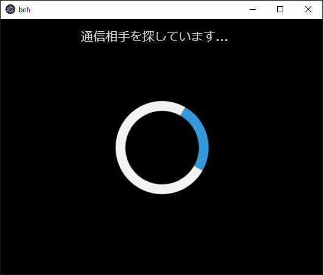
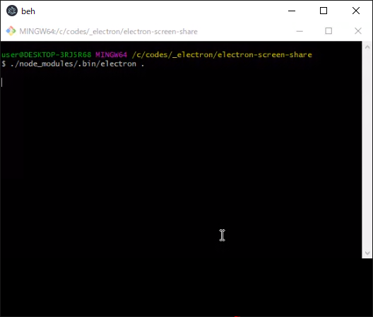
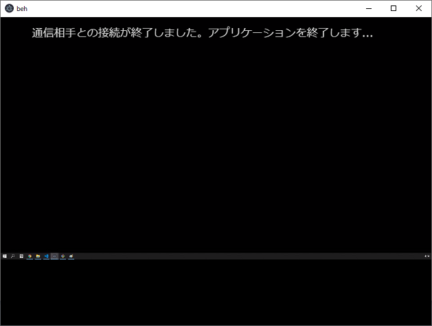

# electron-screen-share
- Firebase DatabaseベースのWebRTC通信により、二人のピアが画面の共有を行えるアプリです。
- This electron app enables two clients to share screens through WebRTC connection based on Firebase Database.

# What it does
- 起動後、画面の選択を行います。

- 選択後、ピアの探索を行います。
  - Firebase databaseの設定ファイルが存在しない場合、ここで`conf.json`ファイルの雛形が作成され、アプリケーションを終了します。お手元の情報を入力して再起動してください。
  - If launched for first time, the app will close after creating `conf.json` so you can set your own api-keys and such.

  

- ピアのOfferとAnswerが成立したならば、相互に画面を共有します。

- 相手がアプリケーションを終了するなどしてピアとの接続が切断された場合、アプリケーションを終了処理に遷移します。

# References(JP)
  - WebRTC入門2016
    - https://html5experts.jp/series/webrtc2016/
    - https://github.com/kotazuck/webrtc-test
    - WebRTC実装を大いに参考にしました
    - WebRTC implementation is pretty much taken from here (except for some OOP attempts).
  - WebRTCでビデオチャットアプリを作ってみた！
    - https://qiita.com/lighthouse/items/34bb8ccb6149bbfae427
  - WebRTCのシグナリングにFirebase Realtime Databaseを使ってP2P通信をしてみた
    - https://qiita.com/Yamazin/items/9c4a87e9685fe34ebf8c
